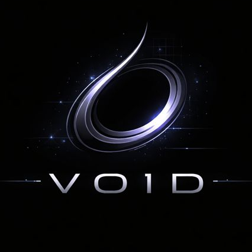
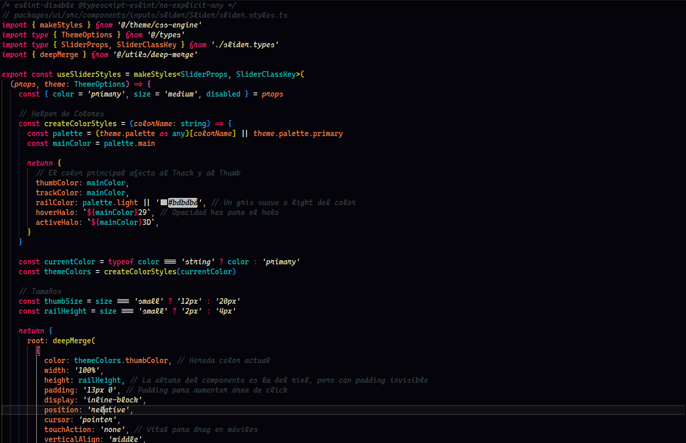
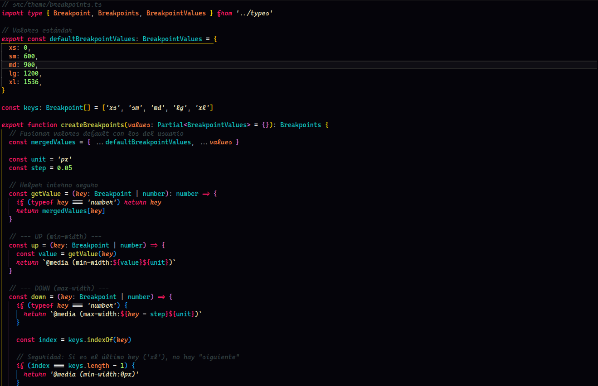

  

<h1 align="center">V01D</h1>

  A minimal dark theme forged from digital silence.

---

## 🜏 Overview

**V01D** is a dark, minimal and high-contrast theme designed for long coding sessions.
Focused on clarity, calm colors and visual silence.

Ideal for:

- Night coding
- Low eye strain
- Minimalist workflows

---

## 🎨 Screenshots

### Editor

<!-- > ⚠️ Usa imágenes locales, NO URLs externas -->

---

## ⚙️ Installation

1. Open **VS Code**
2. Go to **Extensions**
3. Search for **V01D**
4. Click **Install**
5. `Ctrl + K` → `Ctrl + T` → Select **V01D**

---

## 🧩 Supported Languages

- JavaScript / TypeScript
- Vue / React
- HTML / CSS
- JSON / Markdown

---

## 🌑 Color Philosophy

- Background: deep dark
- Accents: subtle neon
- Syntax: calm, readable, balanced

---

## 📦 Versioning

This theme follows semantic versioning.

---

## 🛡 License

MIT © Victor Manuel Carrillo Rojas

Some commercial and redistribution use cases require explicit
permission from the author.  
See [PERMISSIONS.md](PERMISSIONS.md) for details.
