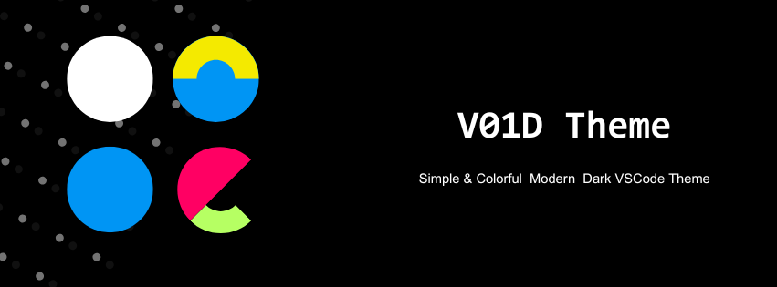

# V01D Theme: Simple & Colorful modern Dark VSCode Theme

---

Enhance your coding experience with v01d-theme, a dark theme with colorful and elegant syntax highlighting. This v01d theme is inspired by the visual comfort of a dark screen, with distinct and vibrant colors to highlight key elements and a vibrant color palette for effortless programming.

## Features

- 🌑 Dark and deep style
- 🕶️ High contrast for better readability
- 🖌️ Vibrant and distinctive color palette
- 👁️ Perfect for night use
- ✏️ Modern clean design for coding

## Screenshots

<!-- > ⚠️ Usa imágenes locales, NO URLs externas -->

## Installation

1. Open **VS Code**
2. Go to **Extensions**
3. Search for **V01D**
4. Click **Install**
5. `Ctrl + K` → `Ctrl + T` → Select **V01D**

## Customization

V01d can be customized to your liking. Check out the VS Code theme customization guide for more information.

## Color Philosophy

- Background: deep dark
- Accents: subtle neon
- Syntax: calm, readable, balanced

## License

MIT © Victor Manuel Carrillo Rojas

Some commercial and redistribution use cases require explicit
permission from the author.  
See [PERMISSIONS.md](PERMISSIONS.md) for details.
